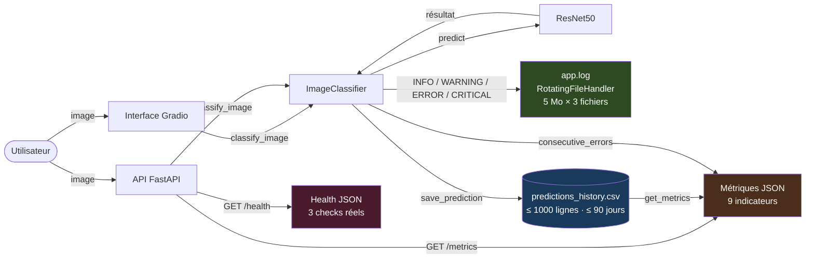
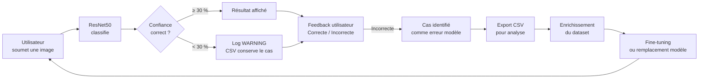

# Système de Monitoring — Application de Classification d'Images IA

**Projet :** Classification d'Images IA — ResNet50 + FastAPI + Gradio  
**Auteur :** Gabriel Guery  
**Date :** 09 mai 2026

---

## 1. Présentation du système de monitoring

L'application de classification d'images embarque un dispositif de monitoring entièrement intégré au code source, sans dépendance à des services tiers. Il couvre quatre axes :

- **Journalisation** : enregistrement horodaté de chaque événement applicatif dans un fichier rotatif et en console.
- **Historique des prédictions** : persistance structurée dans un fichier CSV, avec rétention limitée pour la conformité RGPD.
- **Exposition des métriques** : endpoint REST `/metrics` interrogeable à tout moment.
- **Détection automatique d'incidents** : trois mécanismes d'alerte configurables depuis un fichier central.

### Schéma de la chaîne de monitoring



### Approche MLOps

Le monitoring adopte une approche **MLOps légère** adaptée à un projet local avec modèle pré-entraîné :

- **Observabilité** : chaque prédiction est tracée avec son score de confiance, son temps de réponse et le feedback utilisateur.
- **Détection d'anomalies** : trois seuils configurables déclenchent des alertes automatiques.
- **Feedback loop** : les retours utilisateurs alimentent le CSV, qui constitue la matière première de l'analyse continue (voir section 8).
- **Traçabilité** : le fichier `app.log` permet de rejouer la chronologie de tout incident a posteriori.

---

## 2. Choix techniques et justification

### Outils retenus

| Composant | Outil retenu | Justification |
|---|---|---|
| Journalisation | `logging` Python natif + `RotatingFileHandler` | Module de la bibliothèque standard, aucune dépendance supplémentaire, niveaux sémantiques (INFO/WARNING/ERROR/CRITICAL), rotation automatique à 5 Mo × 3 archives |
| Stockage historique | CSV + `pandas` | Format lisible par tous les outils (Excel, Jupyter, dashboards), `pandas` déjà requis pour le projet, zéro configuration de base de données |
| Détection d'incidents | Compteur en mémoire + seuils configurables | Réponse immédiate sans latence réseau, intégration directe dans la logique métier, remise à zéro automatique au premier succès |
| Exposition métriques | Endpoint REST `/metrics` FastAPI | Interrogeable via `curl`, intégrable dans n'importe quel outil de supervision externe, cohérent avec l'architecture API déjà en place |
| Healthcheck | Endpoint REST `/health` FastAPI avec 3 vérifications | Vérification de l'état réel des composants (modèle, CSV, log), retourne HTTP 503 en cas de défaillance |
| Configuration | `config.py` centralisé | Tous les seuils modifiables en un seul endroit, sans toucher à la logique applicative |

### Outils écartés

| Outil | Raison de l'exclusion |
|---|---|
| **Prometheus + Grafana** | Sur-dimensionné pour un projet local sans cluster Kubernetes ; nécessite un déploiement séparé et une maintenance permanente |
| **MLflow** | Conçu pour le suivi d'expériences d'entraînement ; sans intérêt ici où le modèle (ResNet50 pré-entraîné) n'est pas réentraîné |
| **Sentry** | Service payant au-delà du quota gratuit, introduit une dépendance réseau et une transmission de données vers un tiers |
| **ELK Stack** (Elasticsearch + Logstash + Kibana) | Infrastructure lourde (minimum 4 Go RAM), inadaptée à un environnement de développement local |
| **Datadog / New Relic** | Solutions SaaS payantes, inutiles pour un seul service Python en local |

---

## 3. Métriques surveillées et seuils d'alerte

| Métrique | Description | Seuil d'alerte | Niveau | Action déclenchée |
|---|---|---|---|---|
| `predictions_totales` | Nombre cumulé de prédictions depuis la création du CSV | — | INFO | Aucune |
| `erreurs` | Nombre de prédictions ayant retourné un message d'erreur (classe commençant par "Erreur") | — | INFO | Aucune |
| `taux_erreur_pct` | Ratio erreurs / prédictions totales, exprimé en pourcentage | — | INFO | Aucune |
| `erreurs_consecutives_courantes` | Nombre d'erreurs successives sans aucune prédiction réussie intercalée ; remis à zéro au premier succès | ≥ 3 | CRITICAL | Log `CRITICAL` — signale une défaillance système nécessitant une intervention |
| `confiance_faible` | Nombre de prédictions dont le score de confiance est inférieur à 30 % | À chaque occurrence | WARNING | Log `WARNING` — indique que le modèle est incertain sur la classe retournée |
| `confiance_moyenne_pct` | Moyenne arithmétique des scores de confiance sur l'ensemble du CSV | — | INFO | Aucune |
| `temps_reponse_courant_ms` | Durée de traitement de la dernière prédiction (prétraitement + inférence) | > 1 000 ms | WARNING | Log `WARNING` — signale une latence anormale pouvant dégrader l'expérience utilisateur |
| `temps_reponse_moyen_ms` | Moyenne des temps de réponse sur l'ensemble du CSV | — | INFO | Aucune |
| `feedback_correct` | Nombre de prédictions évaluées "Correcte" par l'utilisateur | — | INFO | Aucune |
| `feedback_incorrect` | Nombre de prédictions évaluées "Incorrecte" par l'utilisateur | — | INFO | Aucune |

**Note sur `erreurs_consecutives_courantes` :** ce compteur est conservé en mémoire vive. Il est remis à zéro à chaque prédiction réussie et repart de zéro au redémarrage de l'application. Le CSV conserve quant à lui le décompte historique total des erreurs.

---

## 4. Mise en œuvre technique

### 4.1 Système de journalisation

**Configuration — `main.py`**

```python
import logging
from logging.handlers import RotatingFileHandler
from config import LOGGING_CONFIG

# Formateur commun aux deux sorties
_formatter = logging.Formatter(LOGGING_CONFIG["format"])

# Rotation automatique : nouveau fichier à 5 Mo, 3 archives conservées
_file_handler = RotatingFileHandler(
    LOGGING_CONFIG["file"],          # "app.log"
    maxBytes=LOGGING_CONFIG["max_bytes"],      # 5 242 880 octets
    backupCount=LOGGING_CONFIG["backup_count"],  # app.log.1, app.log.2, app.log.3
    encoding="utf-8"
)
_file_handler.setFormatter(_formatter)

# Sortie console pour le débogage en développement
_console_handler = logging.StreamHandler()
_console_handler.setFormatter(_formatter)

logging.basicConfig(
    level=getattr(logging, LOGGING_CONFIG["level"]),  # INFO
    handlers=[_file_handler, _console_handler]
)
logger = logging.getLogger("ImageClassifier")
```

**Format des logs**

```
2026-05-09 14:32:07,412 — INFO — Prédiction OK : 'Labrador Retriever' | Confiance : 87.43% | Temps : 312ms
2026-05-09 14:33:01,018 — WARNING — INCIDENT — Confiance faible : 18.72% pour 'Hen' (seuil : 30.0%)
2026-05-09 14:34:55,203 — ERROR — Erreur lors de la prédiction : Input shape incompatible
2026-05-09 14:34:55,204 — CRITICAL — INCIDENT CRITIQUE — 3 erreurs consécutives ! Intervention requise.
```

**Politique de rotation**

| Paramètre | Valeur |
|---|---|
| Taille max par fichier | 5 Mo |
| Archives conservées | 3 (`app.log.1`, `app.log.2`, `app.log.3`) |
| Espace disque max | ~20 Mo (4 fichiers × 5 Mo) |
| Encodage | UTF-8 |

Quand `app.log` atteint 5 Mo, il est renommé `app.log.1`, l'ancien `app.log.1` devient `app.log.2`, etc. Le quatrième fichier est supprimé automatiquement.

---

### 4.2 Historique des prédictions

**Schéma du fichier `predictions_history.csv`**

| Colonne | Type | Exemple |
|---|---|---|
| `timestamp` | string `YYYY-MM-DD HH:MM:SS` | `2026-05-09 14:32:07` |
| `image_name` | string | `image` |
| `predicted_class` | string | `Labrador Retriever` |
| `confidence` | float (%) | `87.43` |
| `top_5_predictions` | string multi-lignes | `1. Labrador Retriever: 87.43%\n2. ...` |
| `response_time_ms` | float | `312.0` |
| `feedback` | string ou vide | `Correcte` / `Incorrecte` / `` |

**Politique de rétention — double contrainte**

```python
# Contrainte 1 : volume (main.py — save_prediction)
max_rows = MONITORING_CONFIG["max_history_rows"]   # 1 000 lignes
if len(df) > max_rows:
    df = df.tail(max_rows)   # suppression des entrées les plus anciennes

# Contrainte 2 : durée (main.py — purge_old_predictions, appelée au démarrage)
limite = datetime.now() - timedelta(days=MONITORING_CONFIG["retention_days"])  # 90 jours
df = df[df["timestamp"] >= limite]
```

La contrainte atteinte en premier s'applique. Exemple : si 1 000 prédictions sont accumulées en 30 jours, la contrainte volumique s'applique avant la contrainte temporelle.

**Conformité RGPD**

| Donnée | Collectée | Justification |
|---|---|---|
| Horodatage | ✅ Oui | Traçabilité des incidents, analyse temporelle |
| Classe prédite | ✅ Oui | Cœur du service, nécessaire à la feedback loop |
| Score de confiance | ✅ Oui | Détection des prédictions à risque |
| Top 5 prédictions | ✅ Oui | Analyse des cas ambigus pour réentraînement |
| Temps de réponse | ✅ Oui | Détection de latence anormale |
| Feedback utilisateur | ✅ Oui (optionnel) | Alimentation de la feedback loop |
| Image source | ❌ Non | Aucune écriture binaire dans le code |
| Adresse IP | ❌ Non | `request.client` jamais capturé |
| Métadonnées EXIF | ❌ Non | `PIL.ExifTags` jamais utilisé |
| Identifiant utilisateur | ❌ Non | Aucun système d'authentification |

---

### 4.3 Endpoints de monitoring

#### `/health` — Vérifications réelles

**Code — `api.py`**

```python
@app.get("/health")
def health():
    """Vérifie l'état réel des composants critiques de l'application."""
    checks = {}
    erreurs = []

    # Vérification : modèle chargé en mémoire
    checks["model_loaded"] = classifier.model is not None
    if not checks["model_loaded"]:
        erreurs.append("Le modèle ResNet50 n'est pas chargé en mémoire")

    # Vérification : fichier CSV accessible en lecture/écriture
    try:
        with open(FILE_CONFIG["history_file"], "r+", encoding="utf-8"):
            pass
        checks["history_file_accessible"] = True
    except Exception:
        checks["history_file_accessible"] = False
        erreurs.append(f"Fichier CSV inaccessible : {FILE_CONFIG['history_file']}")

    # Vérification : fichier de log accessible en écriture
    try:
        with open(LOGGING_CONFIG["file"], "a", encoding="utf-8"):
            pass
        checks["log_file_writable"] = True
    except Exception:
        checks["log_file_writable"] = False
        erreurs.append(f"Fichier log inaccessible : {LOGGING_CONFIG['file']}")

    if erreurs:
        return JSONResponse(
            status_code=503,
            content={"statut": "dégradé", "modele": "ResNet50",
                     "checks": checks, "erreurs": erreurs}
        )
    return {"statut": "ok", "modele": "ResNet50", "checks": checks}
```

**Réponse nominale (HTTP 200)**

```json
{
  "statut": "ok",
  "modele": "ResNet50",
  "checks": {
    "model_loaded": true,
    "history_file_accessible": true,
    "log_file_writable": true
  }
}
```

**Réponse dégradée (HTTP 503)**

```json
{
  "statut": "dégradé",
  "modele": "ResNet50",
  "checks": {
    "model_loaded": true,
    "history_file_accessible": false,
    "log_file_writable": true
  },
  "erreurs": ["Fichier CSV inaccessible : predictions_history.csv"]
}
```

#### `/metrics` — Métriques complètes

**Exemple de réponse JSON**

```json
{
  "predictions_totales": 47,
  "erreurs": 3,
  "taux_erreur_pct": 6.38,
  "erreurs_consecutives_courantes": 0,
  "confiance_faible": 5,
  "confiance_moyenne_pct": 74.2,
  "temps_reponse_moyen_ms": 428.0,
  "feedback_correct": 12,
  "feedback_incorrect": 2
}
```

---

### 4.4 Détection automatique d'incidents

#### Seuil 1 — Confiance faible (`main.py`)

```python
# Déclenché à chaque prédiction dont le score est inférieur au seuil
if main_confidence < MONITORING_CONFIG["confidence_threshold"]:   # 30.0 %
    logger.warning(
        f"INCIDENT — Confiance faible : {main_confidence:.2f}% "
        f"pour '{main_class}' (seuil : {MONITORING_CONFIG['confidence_threshold']}%)"
    )
```

#### Seuil 2 — Erreurs consécutives (`main.py`)

```python
self.consecutive_errors += 1   # incrémenté à chaque exception

if self.consecutive_errors >= MONITORING_CONFIG["consecutive_errors_threshold"]:  # 3
    logger.critical(
        f"INCIDENT CRITIQUE — {self.consecutive_errors} erreurs consécutives ! "
        "Intervention requise."
    )

# Remise à zéro automatique à la première prédiction réussie
self.consecutive_errors = 0
```

#### Seuil 3 — Latence anormale (`main.py`)

```python
# Déclenché après chaque prédiction réussie dépassant le seuil
if response_time_ms > MONITORING_CONFIG["response_time_threshold_ms"]:  # 1 000 ms
    logger.warning(
        f"INCIDENT — Latence anormale : {response_time_ms:.0f}ms "
        f"(seuil : {MONITORING_CONFIG['response_time_threshold_ms']}ms)"
    )
```

**Tableau récapitulatif des conditions de déclenchement**

| Mécanisme | Déclenchement | Remise à zéro | Niveau |
|---|---|---|---|
| Confiance faible | À chaque prédiction < 30 % | Automatique (aucun état) | WARNING |
| Erreurs consécutives | Dès la N-ième erreur sans succès intercalé | À la prédiction suivante réussie | CRITICAL |
| Latence anormale | À chaque prédiction > 1 000 ms | Automatique (aucun état) | WARNING |

---

## 5. Conformité RGPD et gestion des données personnelles

### Données collectées

Le système de monitoring collecte exclusivement des données **fonctionnelles et techniques**, sans aucune donnée directement identifiante.

| Donnée | Catégorie | Base légale |
|---|---|---|
| Horodatage de la prédiction | Technique | Intérêt légitime — traçabilité et détection d'incidents |
| Classe prédite et score de confiance | Fonctionnelle | Intérêt légitime — amélioration continue du service |
| Top 5 des prédictions | Fonctionnelle | Intérêt légitime — identification des cas ambigus |
| Temps de réponse | Technique | Intérêt légitime — surveillance des performances |
| Feedback utilisateur | Fonctionnelle (optionnelle) | Intérêt légitime — feedback loop MLOps |

### Données explicitement exclues

- **Images sources** : les fichiers image transmis à l'API sont traités en mémoire (objet `PIL.Image`) et ne sont jamais écrits sur disque. La variable `image_name` dans le CSV contient la valeur générique `"image"`, non le nom du fichier original.
- **Adresses IP** : aucune capture de `request.client` dans le code FastAPI.
- **Métadonnées EXIF** : `PIL.ExifTags` n'est jamais importé ni utilisé.
- **Identifiants utilisateurs** : l'application ne comporte aucun système d'authentification.

### Durée de conservation

| Contrainte | Valeur | Configuration |
|---|---|---|
| Volume maximal | 1 000 lignes | `MONITORING_CONFIG["max_history_rows"]` |
| Durée maximale | 90 jours | `MONITORING_CONFIG["retention_days"]` |

La première contrainte atteinte s'applique. La purge temporelle est exécutée automatiquement au démarrage de l'application via `purge_old_predictions()`.

### Droit à l'effacement

L'utilisateur dispose d'un bouton **"Effacer l'historique"** dans l'interface Gradio, qui recrée un CSV vierge et consigne la suppression dans les logs :

```
2026-05-09 15:00:00 — INFO — RGPD : historique effacé à la demande de l'utilisateur
```

### Registre des traitements

Ce traitement doit être déclaré dans le registre des traitements de l'entité responsable (commanditaire du projet) avec les informations suivantes :

| Champ | Valeur |
|---|---|
| Finalité | Surveillance des performances d'un système IA et amélioration continue |
| Base légale | Intérêt légitime de l'éditeur |
| Données traitées | Résultats de prédiction, métriques de performance, feedback utilisateur |
| Durée de conservation | 90 jours ou 1 000 entrées (premier seuil atteint) |
| Destinataires | Équipe technique du projet uniquement |
| Transferts hors UE | Aucun |

---

## 6. Procédure d'installation et de configuration

### Prérequis

- Python 3.10 ou 3.11 (TensorFlow 2.13+ requis)
- Système : Linux, macOS ou Windows
- RAM : minimum 4 Go (ResNet50 nécessite ~100 Mo de mémoire GPU/CPU)

### Installation

```bash
# 1. Cloner le dépôt
git clone <url-du-depot>
cd <nom-du-projet>

# 2. Créer l'environnement virtuel
python -m venv venv
source venv/bin/activate       # Linux / macOS
# ou : venv\Scripts\activate   # Windows

# 3. Installer les dépendances
pip install -r requirements.txt
```

**Versions des dépendances principales (`requirements.txt`)**

```
tensorflow>=2.13.0
gradio>=4.0.0
pillow>=9.5.0
numpy>=1.24.0
pandas>=2.0.0
requests>=2.31.0
fastapi>=0.110.0
uvicorn>=0.29.0
python-multipart>=0.0.9
```

### Configuration du monitoring

Tous les paramètres sont dans `config.py`. Aucune variable d'environnement n'est requise.

```python
MONITORING_CONFIG = {
    "confidence_threshold": 30.0,       # seuil WARNING confiance faible (%)
    "consecutive_errors_threshold": 3,  # seuil CRITICAL erreurs consécutives
    "max_history_rows": 1000,           # rétention volumique RGPD
    "response_time_threshold_ms": 1000, # seuil WARNING latence (ms)
    "retention_days": 90,              # rétention temporelle RGPD (jours)
}

LOGGING_CONFIG = {
    "level": "INFO",
    "format": "%(asctime)s — %(levelname)s — %(message)s",
    "file": "app.log",
    "max_bytes": 5 * 1024 * 1024,      # 5 Mo par fichier
    "backup_count": 3,                  # 3 archives
}
```

### Permissions fichiers

Les fichiers `app.log` et `predictions_history.csv` sont créés automatiquement dans le répertoire de travail au premier démarrage. S'assurer que le processus dispose des droits en écriture :

```bash
# Vérification des permissions (Linux)
ls -la app.log predictions_history.csv
# Attendu : -rw-r--r-- ou -rw-rw-r--
```

### Lancement et vérification

```bash
# Lancer l'API FastAPI
uvicorn api:app --host 0.0.0.0 --port 8000

# (Optionnel) Lancer l'interface Gradio dans un autre terminal
source venv/bin/activate
python main.py

# Vérifier le healthcheck
curl http://localhost:8000/health

# Consulter les métriques
curl http://localhost:8000/metrics

# Surveiller les logs en temps réel
tail -f app.log

# Tester une prédiction
curl -X POST http://localhost:8000/predict \
  -F "fichier=@/chemin/vers/image.jpg"
```

---

## 7. Procédure d'utilisation pour les équipes techniques

### Lire les logs en cas d'incident

```bash
# Afficher les 50 dernières lignes
tail -50 app.log

# Filtrer les erreurs et alertes uniquement
grep -E "ERROR|WARNING|CRITICAL" app.log

# Rechercher un incident par date
grep "2026-05-09" app.log | grep -E "ERROR|CRITICAL"

# Consulter les archives de rotation
ls -lh app.log*
# → app.log  app.log.1  app.log.2  app.log.3
cat app.log.1 | grep CRITICAL
```

### Interpréter les métriques exposées

```bash
curl http://localhost:8000/metrics
```

| Valeur observée | Interprétation | Action recommandée |
|---|---|---|
| `taux_erreur_pct` > 10 % | Taux d'erreur élevé | Inspecter `app.log` pour identifier la cause |
| `erreurs_consecutives_courantes` ≥ 3 | Défaillance système active | Redémarrer l'application, vérifier `/health` |
| `confiance_faible` élevé | Modèle incertain sur les images soumises | Analyser les images à faible confiance dans le CSV |
| `temps_reponse_moyen_ms` > 2 000 | Latence systémique | Vérifier la charge CPU/RAM du serveur |
| `feedback_incorrect` / `feedback_correct` > 0.3 | Précision insuffisante | Exporter le CSV pour analyser les classes mal prédites |

### Ajuster les seuils d'alerte

Modifier les valeurs dans `config.py`, puis redémarrer l'application :

```python
MONITORING_CONFIG = {
    "confidence_threshold": 40.0,        # Rendre le seuil plus strict
    "consecutive_errors_threshold": 5,   # Tolérer plus d'erreurs avant alerte
    "response_time_threshold_ms": 2000,  # Adapter à un serveur plus lent
    "retention_days": 30,               # Réduire la durée de conservation
}
```

### Exporter le CSV pour analyse externe

```bash
# Copier le fichier pour analyse
cp predictions_history.csv export_$(date +%Y%m%d).csv

# Ouvrir dans Python/Jupyter
python -c "
import pandas as pd
df = pd.read_csv('predictions_history.csv')
print(df.describe())
print('\nClasses les plus prédites :')
print(df['predicted_class'].value_counts().head(10))
print('\nTaux de feedback incorrect :')
fb = df[df['feedback'] != '']
print(f\"{(fb['feedback']=='Incorrecte').sum()} / {len(fb)} = {(fb['feedback']=='Incorrecte').mean()*100:.1f}%\")
"
```

---

## 8. Feedback loop MLOps

La boucle de rétroaction est le mécanisme par lequel les données collectées en production alimentent l'amélioration du modèle.

### Données d'entrée de la boucle

| Source | Données | Usage |
|---|---|---|
| CSV — colonne `confidence` | Prédictions < 30 % | Candidats prioritaires au réentraînement |
| CSV — colonne `feedback` | Valeur "Incorrecte" | Cas confirmés d'erreur du modèle |
| Logs `WARNING` | Messages "Confiance faible" | Détection rapide de dérive sans export CSV |

### Cycle d'amélioration continue



### Actions concrètes issues de l'analyse du CSV

1. **Identifier les classes systématiquement mal prédites** : filtrer `feedback == 'Incorrecte'` et compter par `predicted_class`.
2. **Collecter des images supplémentaires** pour les classes à faible confiance récurrentes.
3. **Ajuster les seuils** si le modèle est globalement trop ou trop peu sensible.
4. **Décider du remplacement du modèle** si le taux d'erreur dépasse un seuil critique sur une longue période.

La valeur de cette boucle réside dans sa continuité : chaque prédiction produite enrichit la base d'observation, qui guide les décisions d'amélioration à moindre coût.

---

## 9. Lien avec la résolution d'incidents

Le système de monitoring a joué un rôle central dans la détection et le diagnostic de l'incident documenté dans [`INCIDENTS.md`](INCIDENTS.md).

### Incident #001 — Erreur de dimensions (28 avril 2025)

**Détection automatique :** sans intervention humaine, le système a enregistré 3 erreurs consécutives dans `app.log` et déclenché une alerte `CRITICAL` en moins de 2 secondes après la première requête défaillante.

**Extrait du log au moment de l'incident :**
```
2025-04-28 10:15:03 — ERROR — Erreur lors de la prédiction : Input shape incompatible...
2025-04-28 10:15:03 — ERROR — Erreur lors de la prédiction : Input shape incompatible...
2025-04-28 10:15:03 — ERROR — Erreur lors de la prédiction : Input shape incompatible...
2025-04-28 10:15:04 — CRITICAL — INCIDENT CRITIQUE — 3 erreurs consécutives ! Intervention requise.
```

**Ce que le monitoring a apporté :**

| Sans monitoring | Avec monitoring |
|---|---|
| L'API retourne HTTP 500 sans détail | Le message d'erreur exact est consigné dans `app.log` |
| Diagnostic manuel requis | La cause (`shape incompatible`) est identifiable en 30 secondes |
| Durée d'incident indéterminée | Alerte CRITICAL déclenchée après 3 erreurs, sans délai |
| Aucune traçabilité | `predictions_history.csv` enregistre l'heure précise de chaque échec |

**Amélioration du monitoring issue de cet incident :** la résolution a confirmé l'utilité du seuil `consecutive_errors_threshold = 3` dans `config.py`. Ce paramètre est désormais documenté comme critique pour la détection précoce de régressions.

---

*Document technique — Classification d'Images IA — ResNet50 + FastAPI + Gradio*
