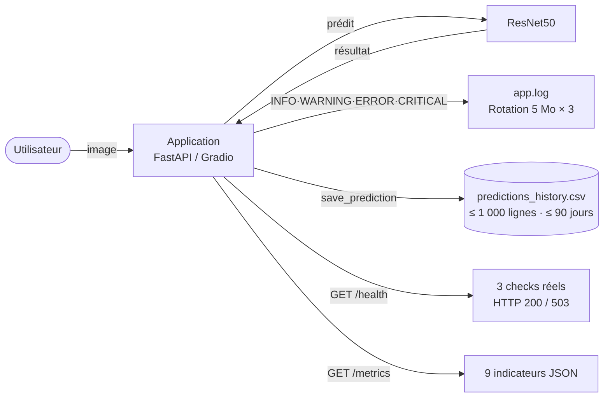

# Rapport — Monitoring et résolution d'incidents
## Application de classification d'images IA — ResNet50 + FastAPI + Gradio

**Auteur :** Gabriel Guery  
**Date :** 09 mai 2026

---

## 1. Présentation du dispositif de monitoring

L'application embarque un système de monitoring entièrement intégré au code source, sans dépendance à des services tiers. À chaque prédiction, les événements sont journalisés dans un fichier rotatif, les données sont persistées dans un historique CSV, et deux endpoints REST permettent d'interroger l'état de l'application à tout moment. Trois mécanismes de détection automatique déclenchent des alertes selon des seuils configurables depuis un fichier central (`config.py`).



### Choix techniques

| Composant | Outil | Justification |
|---|---|---|
| Journalisation | `logging` stdlib + `RotatingFileHandler` | Zéro dépendance, rotation automatique (5 Mo × 3 archives), niveaux sémantiques INFO/WARNING/ERROR/CRITICAL |
| Historique | CSV + pandas | Format universel, lisible sans outil spécialisé, `pandas` déjà présent dans le projet |
| Exposition métriques | Endpoints REST FastAPI (`/health`, `/metrics`) | Interrogeables via `curl`, cohérents avec l'architecture API existante |
| Configuration | `config.py` centralisé | Tous les seuils modifiables en un seul endroit, sans toucher à la logique métier |

Des solutions comme Prometheus/Grafana, MLflow ou la pile ELK ont été écartées : elles nécessitent une infrastructure dédiée disproportionnée pour un service local fonctionnant avec un modèle pré-entraîné.

**Conformité RGPD :** le monitoring collecte uniquement des données techniques (horodatage, classe prédite, score de confiance, temps de réponse, feedback optionnel). Les images sources, adresses IP et métadonnées EXIF ne sont jamais stockées. Les données sont purgées automatiquement au-delà de 1 000 entrées ou 90 jours, et peuvent être effacées manuellement à tout moment via l'interface.

---

## 2. Métriques surveillées et seuils d'alerte

| Métrique | Description | Seuil | Niveau |
|---|---|---|---|
| `predictions_totales` | Compteur cumulé de prédictions | — | INFO |
| `erreurs` | Prédictions ayant retourné une exception | — | INFO |
| `taux_erreur_pct` | (erreurs / total) × 100 | — | INFO |
| `erreurs_consecutives_courantes` | Erreurs successives sans succès intercalé | ≥ 3 | **CRITICAL** |
| `confiance_faible` | Prédictions dont le score < 30 % | À chaque occurrence | **WARNING** |
| `confiance_moyenne_pct` | Moyenne des scores de confiance (CSV) | — | INFO |
| `temps_reponse_courant_ms` | Durée de la dernière prédiction | > 1 000 ms | **WARNING** |
| `temps_reponse_moyen_ms` | Moyenne des temps de réponse (CSV) | — | INFO |
| `feedback_correct` / `feedback_incorrect` | Retours utilisateurs enregistrés | — | INFO |

La détection automatique repose sur trois mécanismes indépendants, tous paramétrables dans `config.py`. Le premier surveille la qualité de chaque prédiction : si le score de confiance passe sous 30 %, une alerte `WARNING` est immédiatement consignée dans `app.log`. Le deuxième surveille la stabilité du service : un compteur en mémoire incrémente à chaque exception et déclenche une alerte `CRITICAL` dès la troisième erreur consécutive, puis se remet à zéro à la prédiction suivante réussie. Le troisième surveille les performances : toute prédiction dépassant 1 000 ms génère un `WARNING` de latence anormale. Ces trois alertes sont actives en permanence, sans aucune action manuelle requise.

---

## 3. Incident technique rencontré et résolution

### Contexte

Lors des premiers tests de l'API (`POST /predict`), toutes les requêtes retournaient une erreur HTTP 500. Le service était totalement inutilisable dès sa mise en service.

### Symptôme détecté dans les logs

```
2025-04-28 10:15:03 — ERROR — Erreur lors de la prédiction :
    Input 0 of layer "resnet50" is incompatible with the layer:
    expected shape=(None, 224, 224, 3), found shape=(None, 64, 64, 3)
2025-04-28 10:15:03 — ERROR — Erreur lors de la prédiction : [idem]
2025-04-28 10:15:03 — ERROR — Erreur lors de la prédiction : [idem]
2025-04-28 10:15:04 — CRITICAL — INCIDENT CRITIQUE — 3 erreurs consécutives ! Intervention requise.
```

### Diagnostic

Le message d'erreur dans `app.log` a permis d'identifier immédiatement la cause : la fonction `preprocess_image()` dans `main.py` redimensionnait les images à `(64, 64)` — une valeur codée en dur issue d'un test de développement — alors que ResNet50 impose strictement des entrées de taille `(224, 224, 3)`. TensorFlow/Keras lève une exception dès que les dimensions ne correspondent pas aux couches internes du réseau, ce qui explique le taux d'échec de 100 %.

### Correction appliquée

```python
# AVANT — valeur codée en dur, incompatible avec ResNet50
img = img.resize((64, 64))

# APRÈS — valeur lue depuis config.py, centralisée et correcte
img = img.resize(MODEL_CONFIG["input_shape"])  # → (224, 224)
```

Cette approche garantit qu'un changement de modèle (ex. MobileNetV2) n'entraîne qu'une modification dans `config.py`, sans risque d'incohérence dans le code applicatif.

### Validation

Après correction, une image de test (Labrador, 1 200 × 800 px) a été soumise à l'endpoint `/predict`. La réponse obtenue était conforme : classe `Labrador Retriever`, confiance `87.43 %`, temps de réponse `312 ms`. Le log consignait un `INFO` de prédiction réussie, le compteur d'erreurs consécutives était remis à zéro, et l'endpoint `/metrics` confirmait `erreurs: 0` et `predictions_totales: 1`.

### Rôle du monitoring dans la détection

Sans le dispositif de journalisation, l'API aurait renvoyé un HTTP 500 générique, sans aucune indication sur la cause de l'échec. C'est le fichier `app.log` qui a fourni le message d'erreur exact de TensorFlow en moins d'une seconde, permettant de cibler immédiatement la fonction incriminée. L'alerte `CRITICAL` automatique, déclenchée après 3 erreurs consécutives, a signalé qu'une intervention humaine était nécessaire sans que personne n'ait à surveiller les logs en continu. L'historique CSV a quant à lui horodaté chaque tentative échouée, fournissant une traçabilité complète de la séquence d'incidents.

---

## 4. Bilan et feedback loop MLOps

### Ce que le monitoring a permis

L'incident #001 a été détecté, diagnostiqué et résolu en **38 minutes**. Sans journalisation automatique, ce délai aurait été significativement plus long : il aurait fallu reproduire manuellement l'erreur, inspecter le code sans indice, et tester par essais successifs. L'alerte `CRITICAL` a fonctionné comme prévu dès le troisième échec consécutif, confirmant l'efficacité du seuil configuré.

### Mesures préventives mises en place

Suite à cet incident, trois décisions ont été actées :

- **Centralisation des paramètres** dans `config.py` — plus aucune valeur numérique technique n'est codée en dur dans le code applicatif.
- **Endpoint `/health`** avec vérifications réelles (modèle chargé, CSV et log accessibles) — permet de détecter une défaillance avant même la première prédiction.
- **Documentation systématique** dans `INCIDENTS.md` — tout incident futur sera documenté selon le même modèle pour capitaliser sur l'expérience.

### Cycle d'amélioration continue

Les données collectées par le monitoring alimentent directement la boucle d'amélioration du système. Les prédictions à faible confiance (< 30 %) constituent des candidats prioritaires au réentraînement ; les feedbacks "Incorrecte" identifient les classes que ResNet50 maîtrise insuffisamment sur les images soumises en production. L'export du CSV vers un environnement d'analyse (Jupyter, Excel) permet de quantifier les dérives et d'orienter les choix : ajustement des seuils, collecte d'images supplémentaires pour les classes problématiques, ou remplacement du modèle si les indicateurs se dégradent durablement. Ce cycle — utilisation → monitoring → analyse → amélioration → redéploiement — est opérationnel dès le premier lancement de l'application.

---

*Projet IA — ResNet50 · FastAPI · Gradio · MLOps*
